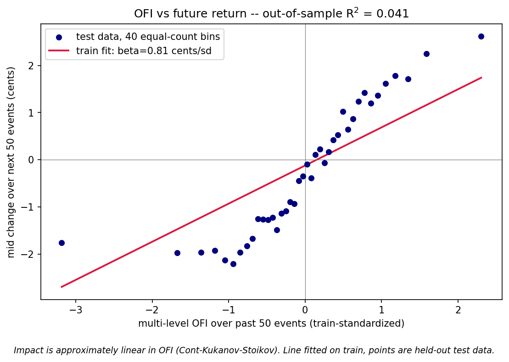
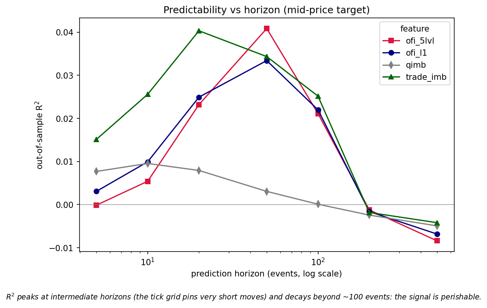
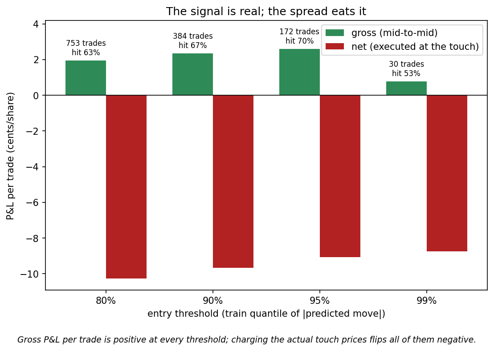

# Order Flow Imbalance as a Short-Horizon Price Predictor

A study of whether imbalances in limit-order-book flow predict the next few
ticks — and an honest account of why the resulting edge cannot be harvested
once the bid–ask spread is charged.

**Headline result.** On NASDAQ LOBSTER data for AAPL (2012-06-21, 263,533
book events, top 5 levels), multi-level order flow imbalance (OFI) over the
past 50 events predicts the mid-price move over the next 50 events with an
**out-of-sample R² of 4.1%** (chronological 70/30 split; Newey–West t ≈ 10).
The price-impact relationship is approximately **linear in OFI**, reproducing
Cont–Kukanov–Stoikov (2014). A toy strategy on the held-out test block wins
**67% of 384 trades** for **+2.3 cents/share gross** — and loses
**−9.7 cents/share net** once each leg is executed at the prevailing touch
prices, because the median spread (15¢) is roughly five times the edge.
The signal is statistically real and economically inaccessible to anyone who
pays the spread. That asymmetry — not a P&L — is the finding.

| | |
|---|---|
|  |  |



---

## 1. Data

LOBSTER sample: `AAPL_2012-06-21`, message + orderbook files, 5 levels,
9:30–16:00. After dropping auction/halt events and trimming 15 minutes from
each end of the session: **263,533 events** (~12.2/sec), median spread
**15¢** on a ~$585 stock (≈ 2.6 bps), median touch depth ~200 shares.
Raw files are not redistributed here (`data/` is gitignored); the loader
expects the two CSVs from LOBSTER's free sample.

LOBSTER prices are integers ×10,000; the scaling is undone once, in
`loader.py`, and nowhere else.

## 2. Features

All features at event *t* use only book states with index ≤ *t*.

- **OFI (per event, per level)** — Cont–Kukanov–Stoikov flow rules, compact
  indicator form (`features.py`); positive = net buying pressure, units =
  shares. Sign conventions are pinned by hand-checked unit tests
  (`tests/test_ofi.py`). Windowed OFI is a trailing sum over the past *K*
  events; **K is set equal to the prediction horizon** (past *h* events
  predict the next *h* — symmetric, one fewer free parameter).
- **Multi-level OFI** — the same rules summed over levels 1–5.
- **Baselines** — queue imbalance at the touch (a level, not a flow) and
  signed trade flow (aggressor-signed executed volume). OFI has to beat
  these to be interesting.

## 3. Method: the no-lookahead checklist

The entire value of a result like this rests on the alignment. Guards, all in
`model.py`:

1. Feature window ends at *t*; the target is the mid change over (*t*, *t+h*].
   They share the boundary point only.
2. Chronological 70/30 split — train is strictly earlier than test
   (n = 184,403 / 79,031 at h = 50). Never shuffled.
3. Feature standardization uses train mean/std only, applied frozen to test.
4. OOS R² is computed on the untouched test block.
5. Overlapping h-event forward returns are mechanically autocorrelated, so
   β t-stats use Newey–West (HAC) errors with maxlags = h.

## 4. Results

Out-of-sample R², mid-price target, by horizon (events):

| horizon | ofi_l1 | ofi_5lvl | qimb | trade_imb |
|--------:|-------:|---------:|-----:|----------:|
| 5   | 0.003 | −0.000 | 0.008 | 0.015 |
| 10  | 0.010 | 0.005  | 0.010 | 0.026 |
| 20  | 0.025 | 0.023  | 0.008 | 0.040 |
| 50  | 0.033 | **0.041** | 0.003 | 0.034 |
| 100 | 0.022 | 0.021  | 0.000 | 0.025 |
| 200 | −0.002 | −0.001 | −0.002 | −0.002 |
| 500 | −0.007 | −0.008 | −0.005 | −0.004 |

Reading of the table:

- **The impact is linear.** Binned test-set returns sit on the train-fitted
  line (fig 1); β ≈ 0.8¢ per standard deviation of 50-event OFI.
- **Predictability peaks at intermediate horizons.** At very short horizons
  the mid is pinned to the tick grid, so there is little variance to explain;
  beyond ~100 events the information has been incorporated and R² goes
  negative (worse than predicting the test mean). The signal has a shelf
  life of roughly 100 events ≈ 8 seconds of median trading.
- **Depth helps at the peak.** Levels 2–5 add ~25% relative R² at h = 50
  (0.041 vs 0.033) but nothing at h ≤ 20 — deep-book flow is slower
  information.
- **Flows beat levels.** Queue imbalance (a static snapshot) is the weakest
  feature everywhere; signed trade flow is the strongest at the shortest
  horizons, OFI at the peak.

### A cautionary artifact worth reporting

Regressing **microprice** returns on **queue imbalance** produces the best
R² in the whole grid (9.6% OOS at h = 10) with a hugely significant
**negative** β (t ≈ −72). It is not alpha: queue imbalance is an input to
the microprice formula, so a stretched microprice mechanically relaxes back
toward the mid as the queue normalizes. The regression rediscovers the
definition. It is left in `results/grid_results.csv` deliberately — it is
exactly the kind of "too good to be true" cell that should trigger suspicion
rather than excitement, and the reason the headline uses the mid.

## 5. The trading evaluation, costs charged honestly

Toy rule on the test block only: enter when |predicted 50-event move| exceeds
a threshold τ (set as a quantile of train predictions), hold exactly 50
events, exit; no overlapping positions. Gross P&L is mid-to-mid; net P&L
executes each leg at the touch (buy at ask, sell at bid) — the half-spread
per leg at that trade's actual quotes, not an average.

| entry threshold | trades | hit rate | gross/trade | net/trade |
|---:|---:|---:|---:|---:|
| 80% | 753 | 63.2% | +1.9¢ | −10.3¢ |
| 90% | 384 | 67.2% | +2.3¢ | −9.7¢ |
| 95% | 172 | 70.3% | +2.6¢ | −9.1¢ |
| 99% | 30  | 53.3% | +0.8¢ | −8.7¢ |

Every threshold is positive gross and negative net. The best gross capture
(+2.6¢) is about one-sixth of the ~15¢ round-trip spread cost. Raising the
threshold improves per-trade quality up to a point (the 99th percentile
bucket is dominated by a handful of outlier events and degrades), but no
selectivity level approaches break-even.

### Who can harvest this edge, and why it isn't you

The evaluation crosses the spread because that is what an outside
participant must do. The economics change for a participant who is already
resting in the queue:

- **Queue position.** A market maker filled passively *earns* the
  half-spread instead of paying it — on these numbers, roughly +7.5¢ per leg
  of advantage. The OFI signal then becomes a reason to *cancel* (skew
  quotes) before being run over, not a reason to take.
- **Adverse selection.** Passive fills are not free money: limit orders get
  filled disproportionately when the price is about to move through them.
  A positive-OFI signal arriving while resting on the ask is precisely the
  moment the fill is toxic. OFI is best understood as a real-time measure of
  the adverse selection passive quotes face.
- **Latency.** The signal decays within ~100 events (seconds). Acting on it
  requires seeing the book update, computing, and reaching the matching
  engine before the rest of the queue reprices — a race this study does not
  model and a retail participant cannot win.

So the result is internally consistent: the information in order flow is
real, and the spread is the price the market charges outsiders for it. The
participants who can monetize it are those whose business is the spread
itself.

## 6. Limitations and what I would do next

- **One symbol, one day.** A single regime (a −$8 down day for AAPL).
  β and the R² peak location should be validated across symbols and days;
  CKS report β scaling inversely with depth, which one day cannot test.
- **Tick-size regime.** AAPL at $585 with a 15¢ spread is a wide-spread,
  ~15-tick stock. On a 1-tick-spread name (e.g. MSFT, spread ≈ 1¢) the cost
  hurdle is far lower and the net result could differ materially. This is
  the single most interesting robustness check left undone.
- **No queue modeling.** The backtest is taker-only. The realistic next step
  is a maker variant: rest at the touch, use OFI to cancel/skew, and model
  fill probability and adverse selection explicitly.
- **In-sample structure choices.** Window = horizon was fixed a priori
  rather than tuned (good for honesty, possibly leaving signal on the
  table). No interaction with volatility/time-of-day regimes.
- **Single-feature linear models.** Deliberate (the linearity *is* the
  finding), but a multivariate model combining OFI + trade flow at multiple
  windows would be the production direction.

## 7. Reproduce

```bash
pip install -r requirements.txt
# place the two LOBSTER sample CSVs in data/
python tests/test_ofi.py     # OFI sign conventions
python -m src.run_all        # all tables + figures into results/
```

`src/` layout: `loader.py` (LOBSTER → tidy event frame) → `features.py`
(OFI, baselines) → `target.py` (forward returns) → `model.py` (leakage-guarded
evaluation) → `backtest.py` (cost-honest strategy) → `plots.py` / `run_all.py`.

## References

- Cont, R., Kukanov, A., Stoikov, S. (2014). *The Price Impact of Order Book
  Events.* Journal of Financial Econometrics 12(1).
- LOBSTER academic data: https://lobsterdata.com
